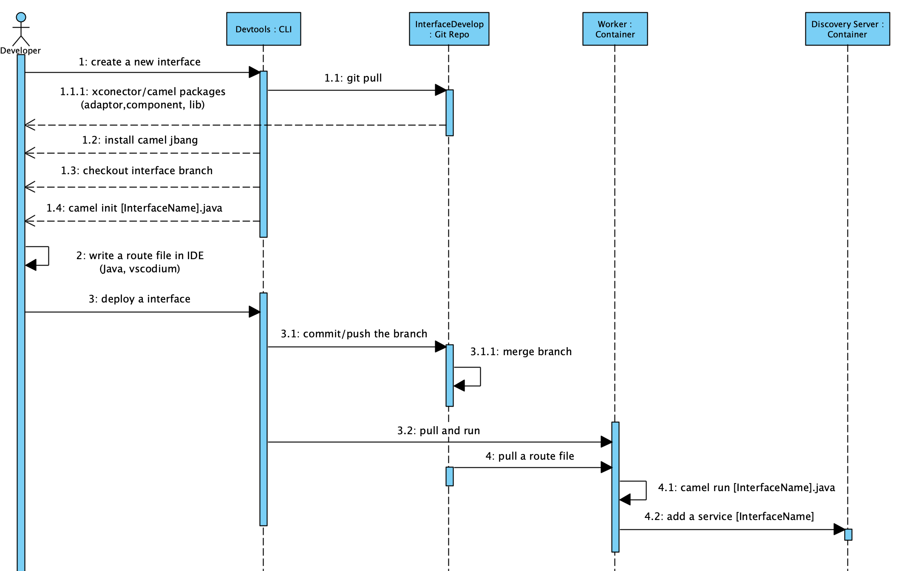
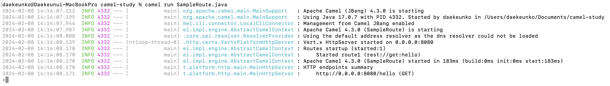

# Camel Jbang 및 Spring Cloud 스타일로 카멜루트 실행

---

# Camel JBang 사용법
https://camel.apache.org/manual/camel-jbang.html

## 카멜 루트 초기화(단일 자바 파일 및 의존성 생성)
```shell
camel init SampleRoute.java
```

```java
// camel-k: language=java

import org.apache.camel.builder.RouteBuilder;

public class SampleRoute extends RouteBuilder {

    @Override
    public void configure() throws Exception {

        // Write your routes here, for example:
        from("timer:java?period={{time:1000}}")
            .setBody()
                .simple("Hello Camel from ${routeId}")
            .log("${body}");
    }
}

```

## 카멜 루트 실행(단일 자바 파일)
```shell
# JBang을 이용하여 프로세스가 실행됨. REST서비스 같은경우에는 Eclipse Vert.x로 실행
camel run SampleRoute.java
# 쿠버네티스 pod이 생성되어 실행됨.
camelk run SampleRoute.java
```
```java
// camel-k: language=java
import org.apache.camel.builder.RouteBuilder;
public class SampleRoute extends RouteBuilder {
    @Override
    public void configure() throws Exception {
        // Write your routes here, for example:
        from("rest:get:hello")
            .transform().constant("Bye World");
    }
}
```


## 카멜 루트 코드 작성
```shell
# VSCodium이 다운로드 받은 후에 실행됨
camel edit SampleRoute.java
```

### 의존성 관리
```java
// camel-k: language=java

// 의존성 관리
// vscodium에서 메이븐 의존성은 자동으로 찾아준다.
//DEPS info.picocli:picocli:4.5.0
//DEPS org.apache.camel:camel-core-model:4.3.0

import picocli.CommandLine;
import picocli.CommandLine.Command;
import picocli.CommandLine.Parameters;

import org.apache.camel.builder.RouteBuilder;
public class SampleRoute extends RouteBuilder {
    @Override
    public void configure() throws Exception {
        // Write your routes here, for example:
        from("rest:get:hello")
            .transform().constant("Bye World");
    }
}
```
